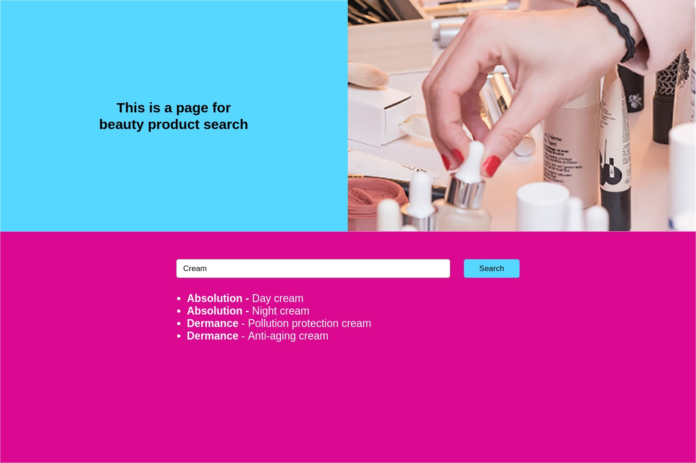
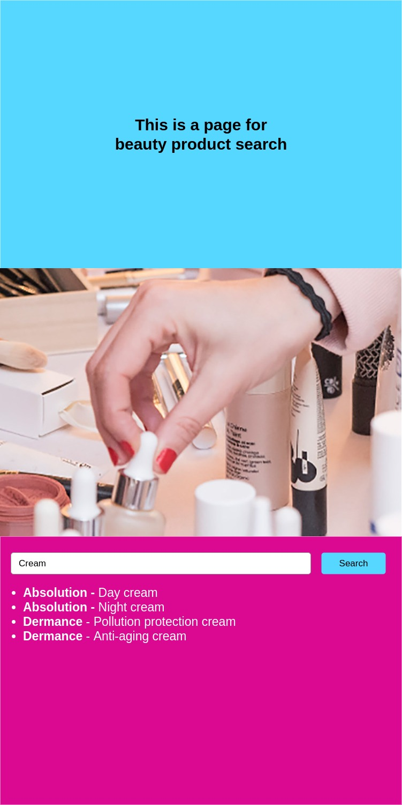

# Front-End Developer Interview Challenge

This goal of this task is to assess your technical skills as a developer, your capacity to work with specifications and your ability to use best practices.

Don't hesitate to ask questions if necessary. You can also make assumptions when necessary as long as you detail them.

Use any online resources you see fit.

## Evaluation

You will be evaluated both on the final result, the choices you made on how to achieve it and the respect of the best practices.

## Context

A beauty shop wants to provide customers with an easy way of finding specific products.

## Proposed Solution

A web application that allows customers to search for a product using a search form.

The given starting code is in Vue.js but you can use React if you are more comfortable with it.

## Your task

Implement a simple proof-of-concept front-end application based on the design sketches provided by the designer.

### Resources

Images and design sketches are located in the resources folder.
Colours are #55D7FF and #DB0992.

### API

The API that will be used is the community based test API [Skin Care API](https://github.com/LauraRobertson/skincareAPI).

The pagination feature of this API is not working. If you encounter any other problem with it, don't hesitate to contact us.

Because of CORS issues, please use the following URL to do a search on the API: 
```https://thawing-scrubland-03171.herokuapp.com/https://skincare-api.herokuapp.com```

#### Desktop



#### Mobile



## Project setup
```
yarn install
```

### Compiles and hot-reloads for development
```
yarn run serve
```

### Compiles and minifies for production
```
yarn run build
```

### Lints and fixes files
```
yarn run lint
```
